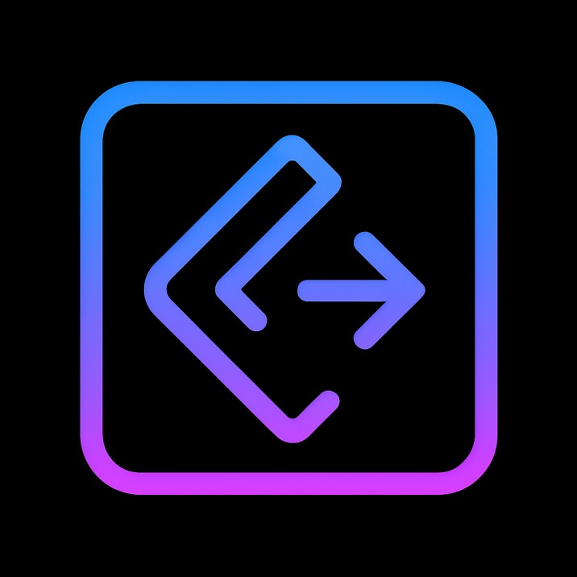

<!-- Typing Header -->

  

  

<!-- Neon Divider -->

  

<!-- Neon GIF -->

  

<!-- Clean, matching neon tagline -->

  

<!-- Neon Divider -->

  

## 🚀 About Me

- 🎓 BTech Student, NIT Kurukshetra, Class of 2027  
- 🤖 Passionate about **Machine Learning**, **Computer Vision**, and building tools that solve real-world problems  
- 🌐 Skilled in both **Frontend finesse** and **Backend logic**  
- ✍️ I enjoy storytelling through data and crafting interactive web tools  
- ☕ Fuel: Coffee, late nights & ambition  

  

## 🌐 Connect With Me

  
  &nbsp;&nbsp;
  
  &nbsp;&nbsp;
  
  &nbsp;&nbsp;
  

  

## 🛠️ Tech Stack

  

